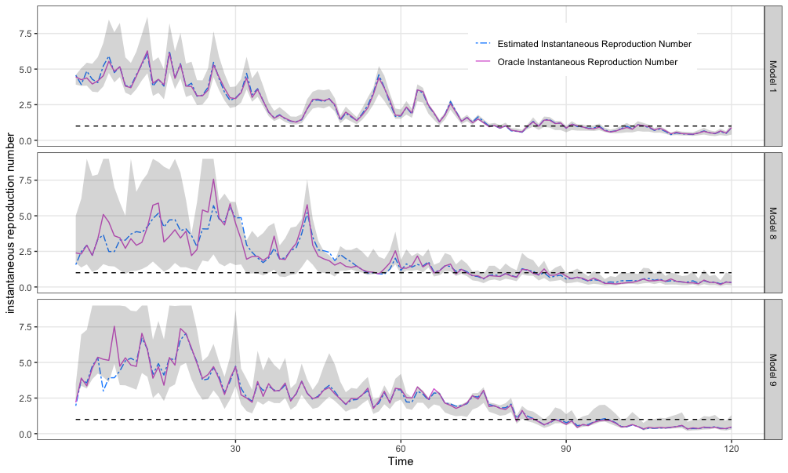

QSOEID: hybrid statistical-epidemiological models for prediction in transmission disease with application to SARS-CoV-2
==============================================
  
  
## Outline
1. Description
2. QSOEID (Quasi-Score online estimation for infectious disease) workflow
3. Package requirements
4. Run QSOEID
5. Results and running time
6. How to run QSOEID on your data?
  
## Description
This README is prepared for journal peer review of the "hybrid statistical-epidemiological models for prediction in transmission disease with application to SARS-CoV-2" paper. 

The proposed Quasi-Score online estimator is proposed for estimating the instantaneous reproduction number of an transmission disease that meets the basic assumptions of time-since-infection model with daily incident cases and covariates data. It allow covariates with measurement error to participate in the model while impose no distributional assumptions, and can update estimators online whenever new data are available.

To demonstrate its usage and performance (as in Section 5 of the paper), we use a simulated data (incident cases of a transmission disease) with time length T=120, initiated incident cases I_0=500 and two simulated covariates data to testify its performance on estimating the association of the instantaneous reproduction number of a transmission disease and potiential covariates. The current code version is written for a special case of the model (as described in Section 4 of the paper) with the link function h being the log function, I_t|\mathcal{F}_{t-1} \sim Poisson(R_t \Lambda_t), the model structure admits AR(1) form and allows two covariates inputs (required to be invertible for its sample covariance matrix with days greater than two.)

Further, the code provides an bootstrap inspection on construct a bootstrap confidence interval for the parameters and a bootstrap confidence band for the instantaneous reproduction number with default tunning parameter block length tunningl=45.

QSOEID is a function coded in QSOEID.R file under [Covid-Quasi-Score](https://github.com/ChorusChow/Covid-Quasi-Score). 

## QSOEID workflow (Figure 2)


## Package Requirements
- A database with clear and consistent variable names
- R version: R (>= 4.0.2)
- On Windows: download and install [pracma](https://CRAN.R-project.org/package=pracma), [ggplot2](https://CRAN.R-project.org/package=ggplot2), [EpiEstim](https://CRAN.R-project.org/package=EpiEstim), [nlme](https://CRAN.R-project.org/package=nlme), [dlnm](https://CRAN.R-project.org/package=dlnm), [tsModel](https://CRAN.R-project.org/package=tsModel), [corrplot](https://CRAN.R-project.org/package=corrplot), [mvtnorm](https://CRAN.R-project.org/package=mvtnorm), [stats](https://CRAN.R-project.org/package=stats), [gridExtra](https://CRAN.R-project.org/package=gridExtra), [ggridges](https://CRAN.R-project.org/package=ggridges),
[lubridate](https://CRAN.R-project.org/package=lubridate)

## Run QSOEID example with code

In the example below we aim to testify the performance of proposed quasi-score online estimation method. Two daily covariates was generated independently from a normal distribution with trend term and a uniform distribution with logistic transformation. The first covariate is generated to mimic the temperature of Philadelphia between Mar.1st and May.31st, 2020, while the second is for mimicking the social distancing measured by a percent change in visits to nonessential businesses revealed by daily cell-phone movement within each county. We using a AR(1) structure and assume the fitted model is correctly specified and thus the parameters of interest would be denoted as (\phi_0,\theta_1,\beta_1,\beta_2).

We run the example in local directory.

Step 1: load related R packages and set tunning parameters

```r
## load packages
library(pracma)
library(ggplot2)
library(EpiEstim)
library(nlme)
library(dlnm)
library(tsModel)
library(corrplot)
library(mvtnorm)
library(stats)
library(gridExtra)
library(ggridges)
library(lubridate)

## set working directory
setwd("~/Desktop/QSOEID")

### Set tunning parameter
## tau_0, pre-specified time point where before date tau_0, the MLE will be applied. Default tau_0=5.
tau_0=5
## NoCov, number of covariates we choose
NoCov=2
## T, number of observations/days
T=120
### R[0], the instantaneous reproduction number at time 0.
R_0=3
## I_0, start cases
I_0=500
## rep, number of replications for bootstrap
rep=200
## tunningl, the block length of a fragment of the time series (daily incident cases) used in bootstrap
tunningl=45
## bias_corr_const, the bias correction constant, default is bias_corr_const=1
bias_corr_const=exp(-0.001/2)
``` 

Step 2: Sample data. To avoid redundancy, we generated sample in a seperated R-file. The sampled data includes covariates Z, being a (T \times NoCov) matrix, incident cases I, and being a (1 \times T) matrix. Further, for the use of present result, we stored oracle instantaneous reproduction number R in the rda-file.

```r
load("sampled_data.rda")
```

Step 3: Run QSOEID

```r
source("QSOEID.R")
timeQSOEID=Sys.time()
restrial1=QSOEID(Z,I)
timeQSOEID=Sys.time()-timeQSOEID

restrial1
``` 

## Results

  Parameter estimation performance together with its Bootstrap 90% confidence interval:
  
  |           | Oracle Value | Esti.     | Boot. Low | Boot. Up |
  |-----------|--------------|-----------|-----------|----------|
  | \phi_0    |     0.5      |  0.5162   |   0.3859  |  0.5652  |
  | \theta_1  |     0.7      |  0.6976   |   0.6614  |  0.7672  |
  | \beta_1   |    -0.02     | -0.0198   |  -0.0285  | -0.0156  |
  | \beta_2   |   -0.125     | -0.1336   |  -0.1368  | -0.0983  |
  
  
  The estimation of the instantaneous reproduction for correctly specified model in comparison with the estimator for two misspecified model (as in Section 5 of the paper).
  
  ```r
  inst.reproduction.nb=data.frame(Time= 1:T)
  inst.reproduction.nb$oracle.R0=R[1,]
  inst.reproduction.nb$Est.R0=restrial1$EstR[2,]
  inst.reproduction.nb$Est.R0.band.upp=restrial1$EstR[3,]
  inst.reproduction.nb$Est.R0.band.low=restrial1$EstR[1,]
  inst.reproduction.nb$type.R0=c("Model 1")
  
  load("misspecified_data_trial1.rda")

  time2<-Sys.time()
  restrial2=QSOEID(Z=Ztrial1[,1:NoCov],I=Itrial1)
  time2=Sys.time()-time2

  inst.reproduction.nb2=data.frame(Time= 1:T)
  inst.reproduction.nb2$oracle.R0=Rtrial1[1,]
  inst.reproduction.nb2$Est.R0=restrial2$EstR[2,]
  inst.reproduction.nb2$Est.R0.band.upp=restrial2$EstR[3,]
  inst.reproduction.nb2$Est.R0.band.low=restrial2$EstR[1,]
  inst.reproduction.nb2$type.R0=c("Model 8")
  
  load("misspecified_data_trial2.rda")

  time3<-Sys.time()
  restrial3=QSOEID(Ztrial2,Itrial2)
  time3=Sys.time()-time3

  inst.reproduction.nb3=data.frame(Time= 1:T)
  inst.reproduction.nb3$oracle.R0=Rtrial2[1,]
  inst.reproduction.nb3$Est.R0=restrial3$EstR[2,]
  inst.reproduction.nb3$Est.R0.band.upp=restrial3$EstR[3,]
  inst.reproduction.nb3$Est.R0.band.low=restrial3$EstR[1,]
  inst.reproduction.nb3$type.R0=c("Model 9")
  
  yuplim=9
  for (i in 1:T) {
     inst.reproduction.nb2$Est.R0.band.upp[i]=min(inst.reproduction.nb2$Est.R0.band.upp[i],yuplim)
     inst.reproduction.nb3$Est.R0.band.upp[i]=min(inst.reproduction.nb3$Est.R0.band.upp[i],yuplim)
  }
  inst.reproduction.nb.combind=rbind(inst.reproduction.nb,inst.reproduction.nb2)
  inst.reproduction.nb.combind=rbind(inst.reproduction.nb.combind,inst.reproduction.nb3)

  mydf <-rbind(inst.reproduction.nb.combind[,c(1,3,4,5,6)], inst.reproduction.nb.combind[,c(1,3,4,5,6)])
  mydf[(1+3*T):(6*T), 2] <- inst.reproduction.nb.combind$oracle.R0
  mydf$group <- rep(c('Estimated Instantaneous Reproduction Number', 'Oracle Instantaneous Reproduction Number'), each=360)
  names(mydf)[2] <- 'R0'
  
  ggplot(mydf, aes(Time)) + 
    geom_line(aes(y=R0, colour=group, lty=group)) + 
    geom_line(aes(y=1), colour="black",lty=2)+
    labs(
         x = "Time",
         y = "instantaneous reproduction number"
    )+
    geom_ribbon(aes(ymin=Est.R0.band.low, ymax=Est.R0.band.upp), alpha=0.2)+
    facet_grid(type.R0 ~ .)+
    theme_bw() + 
    theme(
         panel.grid.minor = element_blank(),
         legend.title = element_blank(),
        legend.position = c(0.75,0.9) 
    ) +
    scale_color_manual(values=c("dodgerblue", "orchid"))+
    scale_linetype_manual(values=c("twodash", "solid"))+
    ylim(0, (yuplim))+
    scale_x_continuous(name='Time', breaks=c(30, 60, 90, 120), 
                     labels=c(30, 60, 90, 120), limits=c(0,120) ) 
  ```
  
  
  
  The running time for QSOEID function in this demo is about 1.7 min. 


## How to run DLMM on your data?

* Get the data ready, which requires no missing values and clear variable names. 
* Set the tunning parameters `tau_0, NoCov, T, R_0, I_0, rep, tunningl, bias_corr_const` so the model is specified. The input data includes covariates Z, being a (T \times NoCov) matrix, incident cases I, and being a (1 \times T) matrix. 
* Directly run `QSOEID` function as illustrated above.